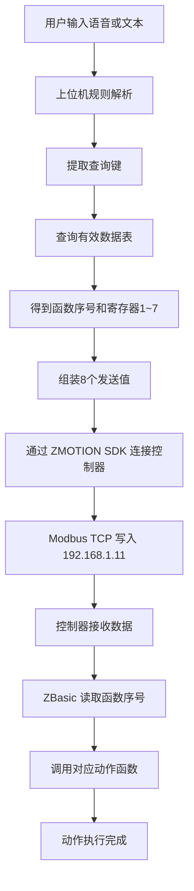

# 实现流程

## 1. 主流程

```text
用户输入 -> 上位机规则解析 -> 查有效数据表 -> 组装8个值 -> Modbus TCP写入 -> 控制器按函数号执行
```

## 2. 详细流程

1. 用户输入文本或语音指令
2. 上位机解析出查询键
3. 上位机在有效数据表中查找该查询键
4. 读取 `函数序号 + 寄存器1~7`
5. 将结果转换为可发送数值
6. 通过 `ZMOTION SDK` 连接控制器
7. 通过 `Modbus TCP` 写入 8 个值
8. 控制器端 `ZBasic` 读取函数序号
9. 控制器根据函数序号调用对应执行函数
10. 动作执行完成

## 3. 开发顺序

### 第一步：打通连接

- 在 Python 中连接 `192.168.1.11`
- 验证 SDK 可正常打开以太网连接

### 第二步：打通写入

- 固定写入一组测试值
- 验证控制器可接收到 8 个值

### 第三步：查表发送

- 从 CSV 读取有效数据表
- 根据查询键生成发送数据

### 第四步：规则解析

- 支持固定短句
- 例如：
  - 移动到位置A
  - 移动到位置B
  - 抓取
  - 放下

### 第五步：GUI

- 输入指令
- 查看查询结果
- 查看即将发送的 8 个值
- 手动发送
- 查看发送日志

## 4. 第一阶段不做的内容

- 复杂多步工艺流程
- 自由对话理解
- 复杂任务队列
- 完整状态机调度
- 深度依赖 DeepSeek

## 5. 可视化流程图


